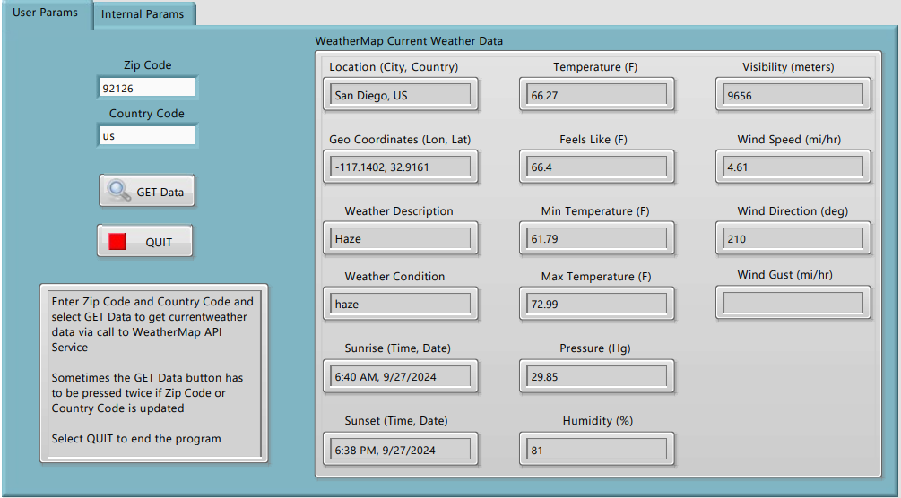
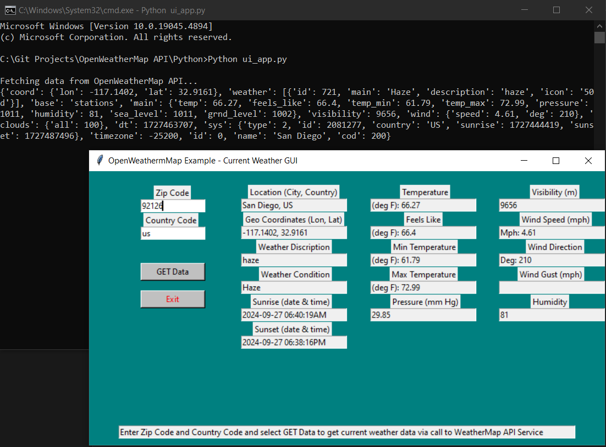
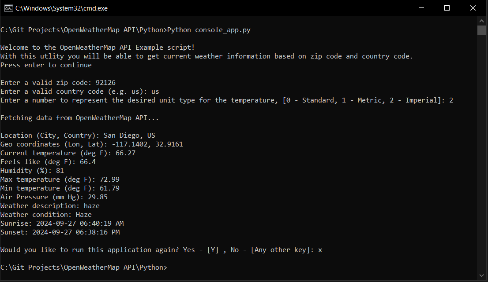

This folder contains source code and an executable build for a simple weather monitioring UI application that utilizes the Weather Map API to get current weather data via utilization of an API key embedded in an HTTP request.  

LabVIEW source code written in LabVIEW 2021 - 32 bit, Windows 10 enviroment

The LabVIEW 2021 Run-Time engine download executable included within the LabVIEW folder may need to be ran first in order to run the LabVIEW-built application.

In order to run the applications, the Weather Map App Settings.cfg file in the current application folder needs to be populated with a valid key for the OpenWeatherMap API - https://openweathermap.org/appid

LabVIEW App GUI:

Python GUI App:

Python Console App Demo Output:
